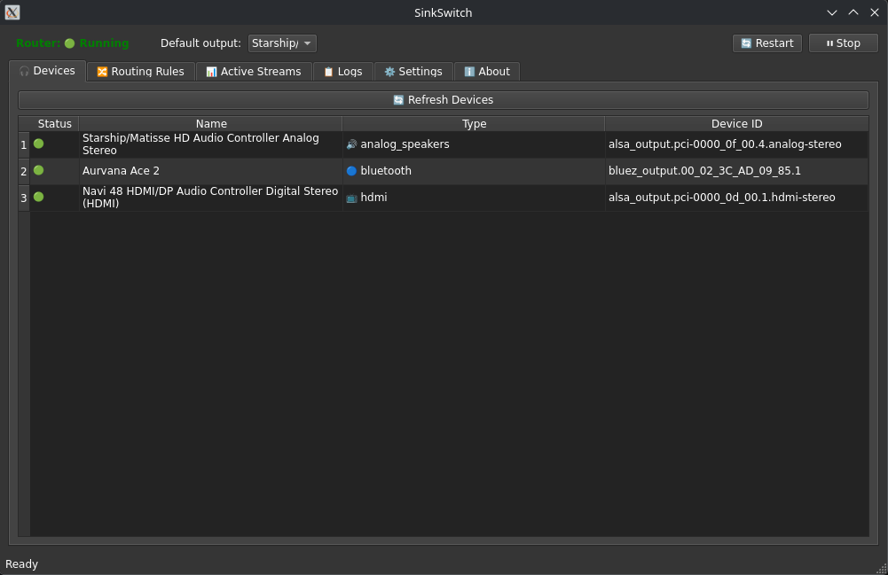

# SinkSwitch

Route application audio to different outputs (Bluetooth, USB, HDMI, etc.) by rule. Runs as a standalone GUI on Linux with PipeWire or PulseAudio.

**What it does:** Pick a default output, then define rules so specific apps (browsers, meetings, music players) always use the device you choose. The router runs inside the app; use **Start** / **Stop** in the toolbar. You see active streams, which rule applies, and can close to tray or launch at login.

## Current UI highlights

- **Devices tab status icons** - The **Status** column uses colored dots: green = connected, red = disconnected, gray = unknown.
- **Active Streams quick route** - Route a selected stream to **Bluetooth**, **HDMI**, or **Analog speakers** with one click.
- **Temporary vs Permanent** - Temporary keeps an in-memory override while the router is running; Permanent saves/updates a rule in config.
- **Route column override label** - Active temporary overrides show as `Temporary override (<device>)` in the **Route** column.



## Default routing (out of the box)

- **First run** — If no config exists, SinkSwitch auto-generates an initial set of routing rules from your connected devices (e.g. browsers, meetings, media → Bluetooth or USB headset when present). You can edit or remove these in the Routing Rules tab.
- **Router off until you start it** — Until you click **Start** in the toolbar, the router does nothing; all apps use the system default output.
- **Default output** — Once the router is running, streams that do not match any rule go to the **Default output** you set in the toolbar. Matched streams go to the device specified by their rule.
- **Single-earbud Bluetooth handling** — Optional in Settings. When enabled and a Bluetooth sink reports a single output channel (common when one earbud is in the case), SinkSwitch routes matching streams through a mono remap sink so left/right content is mixed. When both channels are available, routing stays stereo. If detection fails on your headset, use the **Force Mono** toolbar button to override detection.
- **BlueZ A2DP first-connect fixes** — Optional in Settings. When a headset connects for the very first time (or right after a boot), BlueZ runs a short discovery pass to build its SDP/profile cache. If your sound server grabs the media transport before that cache is ready, BlueZ rejects high-quality A2DP and the headset falls back to HSP/HFP. Two documented fixes are available, applied through an admin (pkexec) dialog with a bluetooth service restart:
  - **Skip reverse service discovery** — sets `ReverseServiceDiscovery = false` in `/etc/bluetooth/main.conf`, removing the discovery window the sound server races into. Side effect: AVRCP version info for the device may be incomplete.
  - **WirePlumber D-Bus policy** — installs `/etc/dbus-1/system.d/bluetooth-wireplumber.conf` so WirePlumber (PipeWire) can send D-Bus replies back to bluetoothd; without it the A2DP sink can be missing until the bluetooth service is restarted (bluez issue #1924).

## Install and run

### Option A: GitHub release (Flatpak)

From [Releases](https://github.com/crashman79/sinkswitch/releases), download **`sinkswitch-<version>-x86_64.flatpak`**, then:

```bash
flatpak install --user ./sinkswitch-<version>-x86_64.flatpak
flatpak run io.github.crashman79.sinkswitch
```

### Option B: Flatpak (build from source)

See **[flatpak/README.md](flatpak/README.md)**. After `flatpak-builder --install`, run `flatpak run io.github.crashman79.sinkswitch`.

### Option C: From source or venv

See **Run from source** below or `packaging/install-user-venv.sh`.

On first run the app creates config at `~/.config/sinkswitch/`. Use the GUI to add routing rules and start the router.

## Run from source

```bash
pip install -r requirements.txt
python3 run_app.py
```

Same config and behavior; config dir is `~/.config/sinkswitch/` (or set `AUDIO_ROUTER_CONFIG`).

### Quick Flatpak build and run (development)

Requires Flatpak, `flatpak-builder`, and Freedesktop 24.08 runtime/SDK (see **[flatpak/README.md](flatpak/README.md)**).

```bash
./build-and-run.sh
```

Use `./build-and-run.sh --clean` to remove the default build directory (`../sinkswitch-flatpak-build`) before rebuilding. Pass app flags after `--`, e.g. `./build-and-run.sh -- --minimized`.

### Releasing a new version

Pushing a tag `v*` runs **Flatpak release**: builds `sinkswitch-<version>-x86_64.flatpak` and creates the GitHub release with that artifact.

1. Bump **`src/_version.py`** and **`flatpak/...metainfo.xml`** `<release>` (or let CI rewrite metainfo + `_version.py` from the tag during the workflow).
2. `git tag v0.8.1 && git push origin v0.8.1`

Run **Flatpak release** manually from the Actions tab (**workflow_dispatch**) to test the Flatpak build without creating a release.

## Config and rules

- **Config dir**: `~/.config/sinkswitch/` (or `AUDIO_ROUTER_CONFIG`)
- **Bundled example layout**: `config/routing_rules.yaml` in this repo (the app uses `~/.config/sinkswitch/config/routing_rules.yaml` at runtime)

Use the GUI to add rules and pick devices; the **Default output** in the toolbar is where unmatched apps go. See `examples/` for YAML samples.

## CLI (scripting / debugging)

With dependencies installed from the repository root:

```bash
python3 src/audio_router.py list-devices
python3 src/audio_router.py generate-config --output config/routing_rules.yaml
python3 src/audio_router.py apply-rules config/routing_rules.yaml
python3 src/audio_router.py monitor config/routing_rules.yaml
```

The GUI runs the monitor internally; these commands are optional.

## Requirements

- Linux with PipeWire or PulseAudio
- For the Flatpak: Freedesktop 24.08 runtime (installed with the bundle)
- For source: Python 3.8+, PyQt6

## License

MIT
